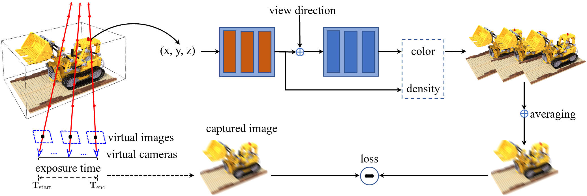

# BAD-NeRF

<a href=" "></a>

This is a PyTorch implementation of the paper [BAD-NeRF: Bundle Adjusted Deblur Neural Radiance Fields](https://arxiv.org/abs/2211.12853). (CVPR 2023)

BAD-NeRF jointly learns the 3D representation and optimizes the camera poses with blurry images and inaccurate initial poses. We will update our project page soon.


## Method overview



We follow the real physical image formation process of a motion blurred image to synthesize blurry images from NeRF. Both NeRF and the motion trajectories are estimated by maximizing the photo-metric consistency between the synthesized blurry images and the real blurry images.

## Quickstart

### 1. Setup environment

```
git clone https://github.com/wangpeng000/bad-nerf.git
cd bad-nerf
pip install -r requirements.txt
```

### 2. Download datasets


The data used in our experiment is a little different from Deblur-NeRF, we synthesize more realistic blurry images by just increasing the number of virtual images to 51 and keep the other settings fixed. You can download the data [here](https://westlakeu-my.sharepoint.com/:f:/g/personal/cvgl_westlake_edu_cn/EsgdW2cRic5JqerhNbTsxtkBqy9m6cbnb2ugYZtvaib3qA?e=bjK7op).

For the scenes of Deblur-NeRF (cozy2room, factory etc.), the folder `images` only includes blurry images and the folder `images_1` additionally includes novel view images. But for our scenes (room-low, room-high and dark), there are no novel view images.


### 3. Configs
Changing the data path and other parameters (if needed) in `configs/cozy2room.txt`.

### 4. Running code

```
python train.py --config configs/cozy2room.txt
```

## Notes

### Camera poses
The poses (`poses_bounds.npy`) are generated from only blurred images (folder `images`) by COLMAP.

### Spline model
We use `linear interpolation` as the default spline model in our experiments, you can simply change the parameter `linear` to `False` to use the higher order spline model (i.e. `cubic B-Spline`).

### Virtual images
You can change the important parameter `deblur_images` to a smaller/bigger value for lightly/severely blurred images.

### Learning rate
After rebuttal, we found that sometimes the gradients will be NaN if `cubic B-Spline` model with a `pose_lrate=1e-3` is used. Therefore, we set the initial pose learning rate to 1e-4 and it may achieve a better performance compared to that in our paper. If the gradient appears NaN in your experiments unfortunately, just kill it and try again or decrease the `pose_lrate`.

## Citation
If you find this useful, please consider citing our paper:
```
@article{wang2022bad,
  title={BAD-NeRF: Bundle Adjusted Deblur Neural Radiance Fields},
  author={Wang, Peng and Zhao, Lingzhe and Ma, Ruijie and Liu, Peidong},
  journal={arXiv preprint arXiv:2211.12853},
  year={2022}
}
```

## Acknowledgment

This source code and the code of computing metrics are respectively derived from [nerf-pytorch](https://github.com/yenchenlin/nerf-pytorch/) and [Deblur-NeRF](https://github.com/limacv/Deblur-NeRF). We appreciate the effort of the contributors to these repositories.
